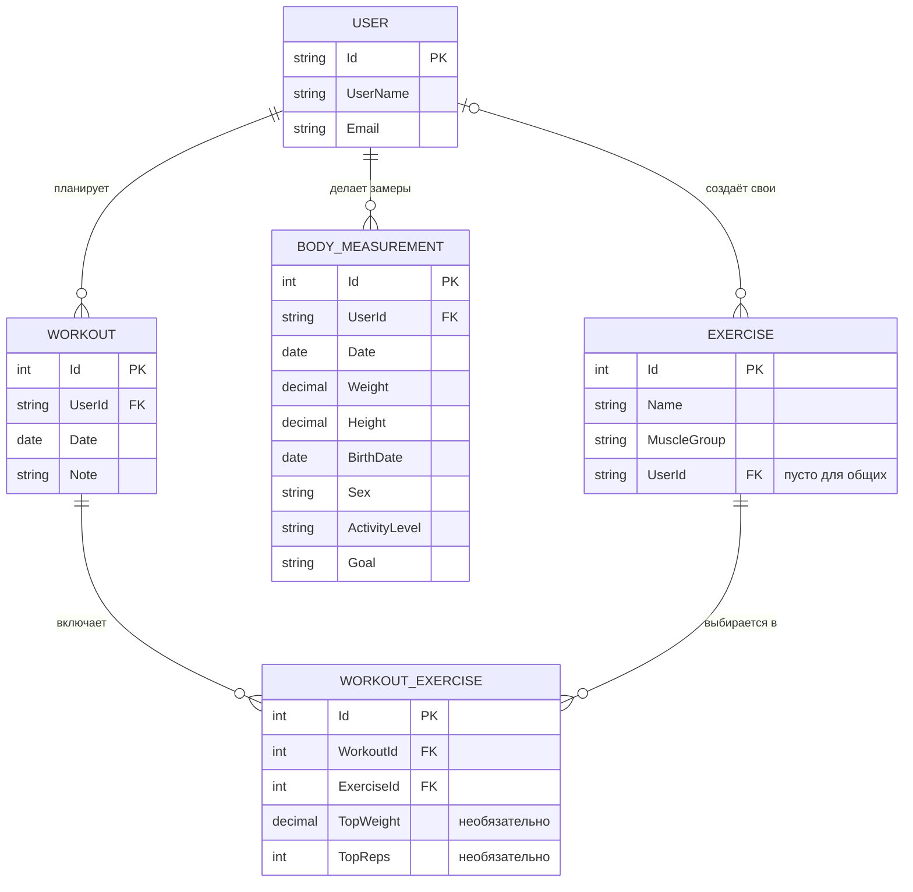

```mermaid
erDiagram
    USER ||--o{ WORKOUT : "планирует"
    USER ||--o{ BODY_MEASUREMENT : "делает замеры"
    USER |o--o{ EXERCISE : "создаёт свои"
    WORKOUT ||--o{ WORKOUT_EXERCISE : "включает"
    EXERCISE ||--o{ WORKOUT_EXERCISE : "выбирается в"

    USER {
        string Id PK
        string UserName
        string Email
    }
    BODY_MEASUREMENT {
        int Id PK
        string UserId FK
        date Date
        decimal Weight
        decimal Height
        date BirthDate
        string Sex
        string ActivityLevel
        string Goal
    }
    EXERCISE {
        int Id PK
        string Name
        string MuscleGroup
        string UserId FK "пусто для общих"
    }
    WORKOUT {
        int Id PK
        string UserId FK
        date Date
        string Note
    }
    WORKOUT_EXERCISE {
        int Id PK
        int WorkoutId FK
        int ExerciseId FK
        decimal TopWeight "необязательно"
        int TopReps "необязательно"
    }
```